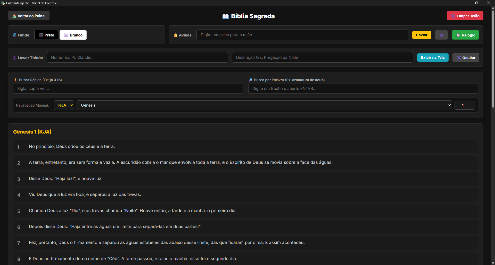

# ⛪ Culto Inteligente - Sistema de Gestão e Projeção com IA

Um ecossistema completo para equipes de mídia de igrejas, projetado para gerenciar letras de músicas, passagens bíblicas, letreiros dinâmicos e geração automática de atas/estudos usando Inteligência Artificial.

## 🚀 Funcionalidades Principais

* **🎙️ Transcrição e Correção com IA:** Capta o áudio do pastor em tempo real, transcreve e utiliza a IA do Google Gemini (Flash 2.5) para corrigir erros gramaticais e formatar o texto sem perder o contexto teológico.
* **📱 Controle Remoto via Smartphone (PWA):** O operador pode controlar o telão andando pela igreja usando o celular conectado à mesma rede Wi-Fi.
* **📺 Projeção de Baixa Latência:** Uso de WebSockets para enviar versículos, louvores e letreiros instantaneamente para a tela do projetor.
* **📖 Banco de Dados Local:** Armazenamento seguro e offline de todo o acervo de louvores, histórico de ensinos e Bíblia Sagrada (SQLite).
* **🖥️ Interface Desktop Nativa:** O painel de controle roda em uma janela isolada (Webview), protegendo o sistema de fechamentos acidentais no navegador.

## 🛠️ Tecnologias Utilizadas

* **Backend:** Python, FastAPI, WebSockets
* **Inteligência Artificial:** Google GenAI (Gemini 2.5 Flash), SpeechRecognition
* **Frontend:** HTML5, CSS3, JavaScript Vanilla
* **Banco de Dados:** SQLite3
* **Desktop Wrapper:** PyWebview
* **Processamento de Áudio e Docs:** Pydub, FPDF

## 📸 Telas do Sistema

### Interface Desktop Nativa


### Estúdio de Gravação com IA


### Interface da Biblia


### Interface Louvor


## ⚙️ Como Executar o Projeto Localmente

1. Clone o repositório:
   ```bash
   git clone [https://github.com/WarleySantoss/culto-inteligente.git](https://github.com/WarleySantoss/culto-inteligente.git)

